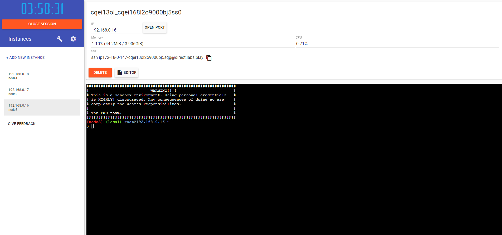

# Отчет по работе с Линуксом

## Создание контейнеров в Play-with-docker

Работа проводилась в среде Play-with-docker.

Сначала добавим три контейнера, нажав кнопку `ADD NEW INSTANCE`.

После добавления контейнеров интерфейс будет выглядеть следующим образом:

Для работы с ними подключимся к каждому контейнеру через терминалы с использованием SSH-соединений.

Теперь настроим сеть с использованием ipvlan. Добавим по одному сетевому адаптеру к каждому из контейнеров A и C:

- ВМ A: IP-адрес 192.168.20.10 с маской 255.255.255.0 (см. рисунок 3)
- ВМ C: IP-адрес 192.168.11.100 с маской 255.255.255.0  

