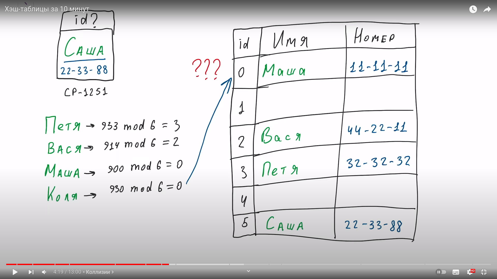

Метод открытой адресации – это техника в компьютерной науке, используемая для обработки коллизий в хэш-таблицах. 🤓 Он заключается в том, что если возникает коллизия (то есть, два ключа сопоставляются одной ячейке хэш-таблицы), то следующая свободная ячейка в таблице ищется с помощью специальной последовательности, например, линейного пробирования или двойного хэширования.Этот метод широко используется в реализации хэш-таблиц в различных языках программирования. 🖥️

- Линейное пробирование - это простой метод открытой адресации, который используется для разрешения коллизий в хеш-таблицах. Когда возникает коллизия (то есть, при вычислении хеша обнаруживается, что ячейка уже занята), линейное пробирование предполагает поиск следующей доступной ячейки с помощью простой последовательности: \(h(k) + 1, h(k) + 2, h(k) + 3, ...\), где \(h(k)\) - хеш-функция от ключа \(k\). Этот процесс продолжается до тех пор, пока не будет найдена пустая ячейка или размер таблицы не будет исчерпан. 🧐
- Квадратичное пробирование - это метод разрешения коллизий в хеш-таблицах, похожий на линейное пробирование. Когда возникает коллизия, квадратичное пробирование использует квадратичную последовательность для поиска следующей доступной ячейки: \(h(k) + 1, h(k) + 4, h(k) + 9, h(k) + 16, ...\), где \(h(k)\) - хеш-функция от ключа \(k\). Этот процесс также продолжается до тех пор, пока не будет найдена пустая ячейка или размер таблицы не будет исчерпан. Одним из преимуществ квадратичного пробирования является то, что он помогает избежать проблемы "применения одного и того же разрешения коллизии для всех ключей" (как в случае с линейным пробированием), но при этом квадратичное пробирование также может столкнуться с проблемой кластеризации. 🤔
- Двойное хеширование - это метод разрешения коллизий в хеш-таблицах, который включает использование второй хеш-функции для вычисления шага пробирования, когда возникает коллизия. Это позволяет избежать проблем, связанных с кластеризацией, которые могут возникать при использовании простого линейного пробирования или квадратичного пробирования.  В двойном хешировании шаг пробирования рассчитывается с использованием второй хеш-функции, и, если исходная ячейка занята, алгоритм продолжает вычислять последующие индексы по формуле \( h(k, i) = (h_1(k) + i \cdot h_2(k)) \mod m \), где \( h_1(k) \) и \( h_2(k) \) - две хеш-функции, \( m \) - размер хеш-таблицы, а \( i \) - количество итераий. Этот метод обеспечивает более равномерное распределение элементов и эффективно решает проблемы, возникающие при стандартных методах пробирования. 🎯

Метод цепочек - это один из методов разрешения коллизий в хеш-таблицах. В этом методе каждая "ячейка" хеш-таблицы представляет собой связанный список элементов, которые имеют одинаковое значение хеш-функции.

Когда коллизия происходит (то есть несколько ключей сопоставляются с одним и тем же значением хеш-функции), новый элемент добавляется в соответствующий связанный список. Это позволяет хранить несколько элементов с одинаковым хешем в одной "ячейке" таблицы.

Метод цепочек позволяет эффективно обрабатывать коллизии, поскольку каждая "ячейка" таблицы фактически является списком, в котором можно добавлять новые элементы без необходимости перемещать другие элементы.

Надеюсь, это объяснение помогло вам лучше понять метод цепочек! 😊

Требования к Хешфункции

Равномерность. Все записи должны быть равномерно распределены по бакетам
Быстрота.
Детерминированность. Для одного и того же ключа функция должна возвращать один номер бакета
Криптоустойчивость. Функция должна быть лишена возможности подбора ключа таким образом что все данные будут попадать в один бакет
