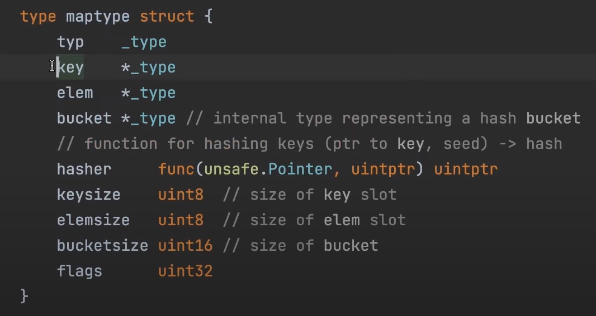
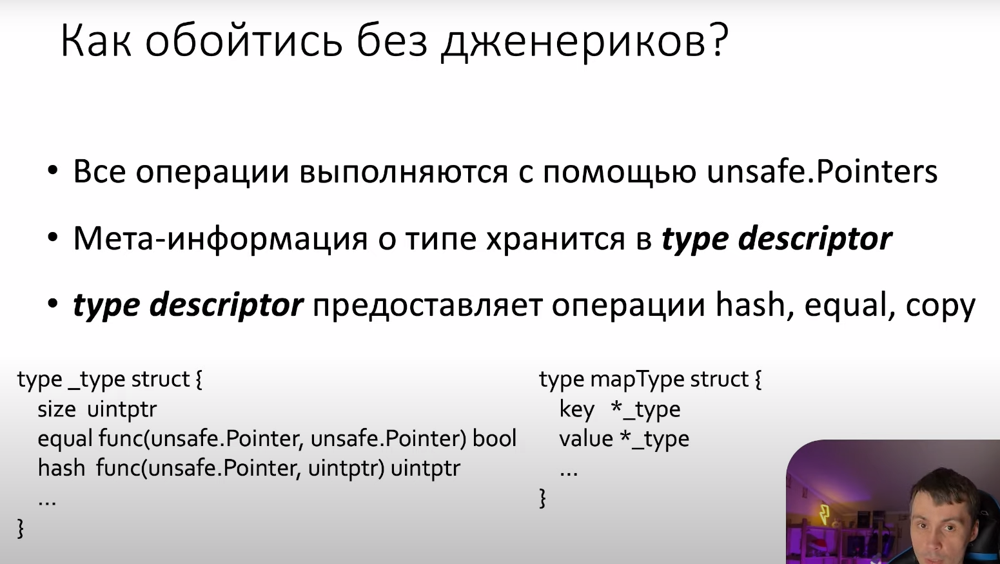
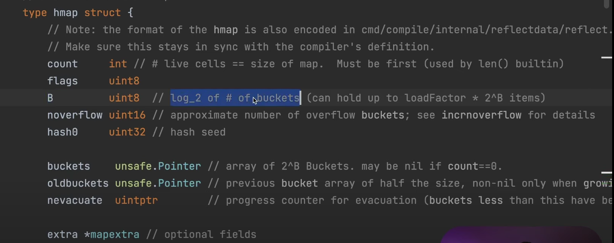
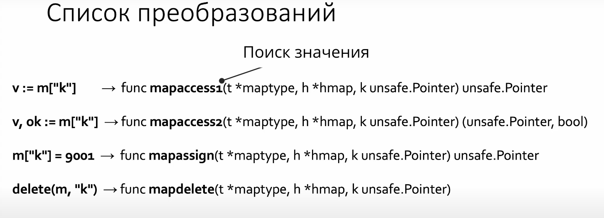
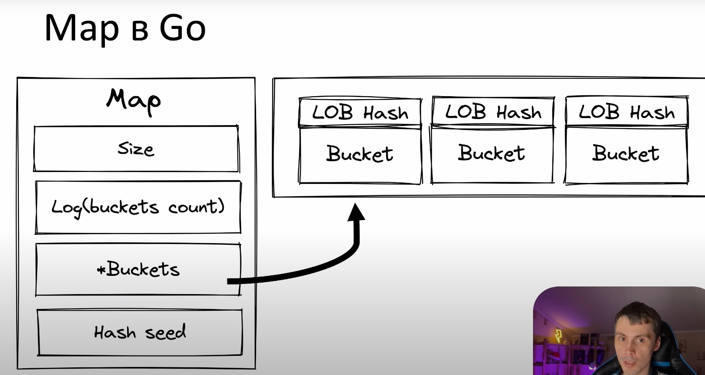
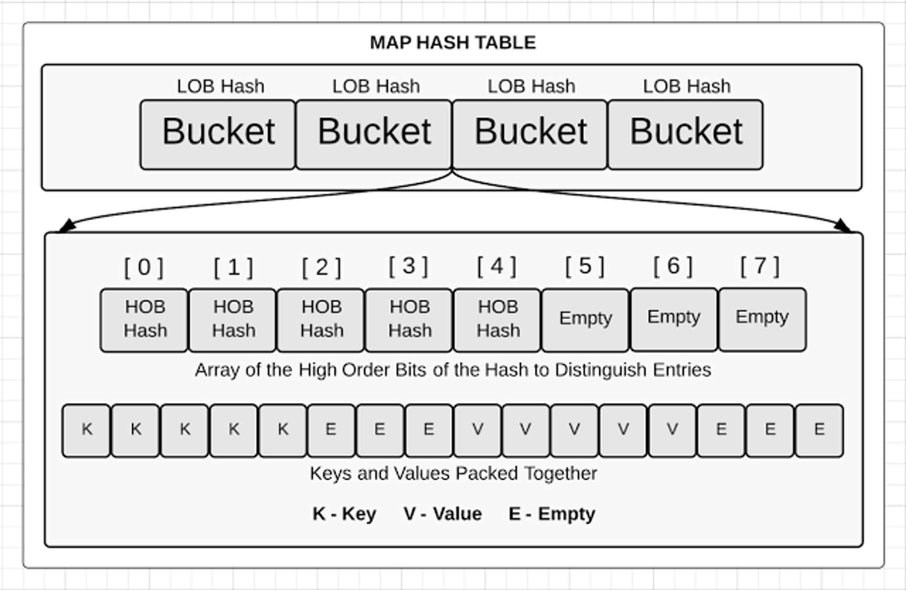
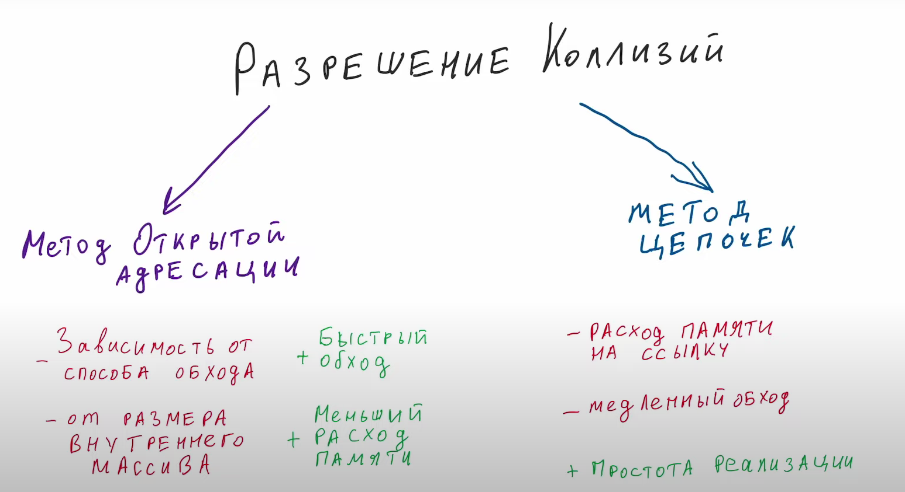

## Map
https://github.com/golang/go/blob/master/src/runtime/map.go

***map** представляет ссылку на хеш-таблицу - структуру данных, где каждый элемент представляет пару "ключ-значение"*

### Упрощенная структура map
```go
type hmap struct {
    count      int // # live cells == size of map. 
                                 // Must be first (used by len() builtin)
    B          uint8  // log_2 of counts of buckets 
                                        //(can hold up to loadFactor * 2^B items)
    buckets    unsafe.Pointer // array of 2^B Buckets. may be nil if count==0.
    oldbuckets unsafe.Pointer // previous bucket array of half the size, 
                                      // non-nil only when growing
}
```

Указатели на данные, попадающие в мапу, хранятся частями — в массиве `buckets`.

`unsafe.Pointer` — указатель на данные любого типа — способ разработчиков GO уйти от проблемы джереников (реализовать функционал мапы с различными типами ключей и значений).

Бакеты не создаются, пока данных в мапе нет. При появлении данных, создается 8 бакетов.
### Структура, которая состоит из полей:

**count** int - колличество элементов в мапе

**flags** uint8 -

**B** uint8 - количество бакетов, представленное в виде log2

**noverflow** uint16 - примерное количество переполненых бакетов

**hash0** uint32 -seed для рандомизации хешей

**buckets** unsafe.Pointer - указатель на бакеты

**oldbuckets** unsafe.Poiter - старые бакеты

**nevacuate** uintptr - счетчик выполненых эвакуаций

**extra** *mapextra - пока хз

LOB = hash(key) % log

### Рост мапы

Рост мапы происходит при одном из двух условий, когда в каждом ведре в среднем по 6.5 элементов, или, когда из-за коллизий, у одного из бакетов есть len бакетов внизу.

В данном случае, выделяется новый массив бакетов, который в 2 раза больше. Старые данные копируются в него меленькими порциями при операциях вставки или удаления.

Требования к Хешфункции
1. Равномерность. Все записи должны быть равномерно распределены по бакетам
2. Быстрота. 
3. Детерминированность. Для одного и того же ключа функция должна возвращать один номер бакета
4. Криптоустойчивость. Функция должна быть лишена возможности подбора ключа таким образом что все данные будут попадать в один бакет





Борьба с коллизиями
1. Метод открытой адресации. Хешируем пока не найдем пустую область памяти. Пробирование
2. Метод цепочек. Ячейка хранит ссылку на слеюущую
