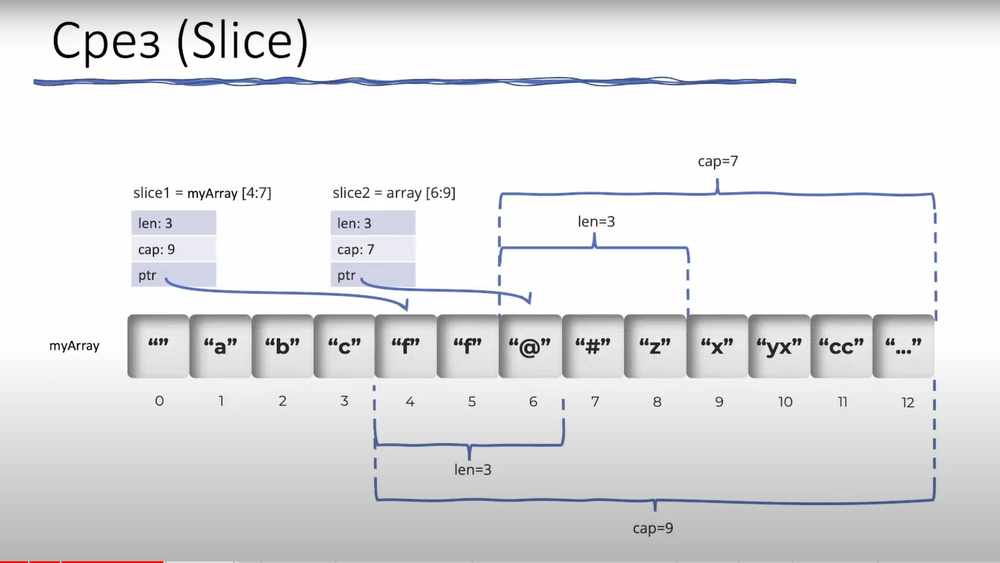
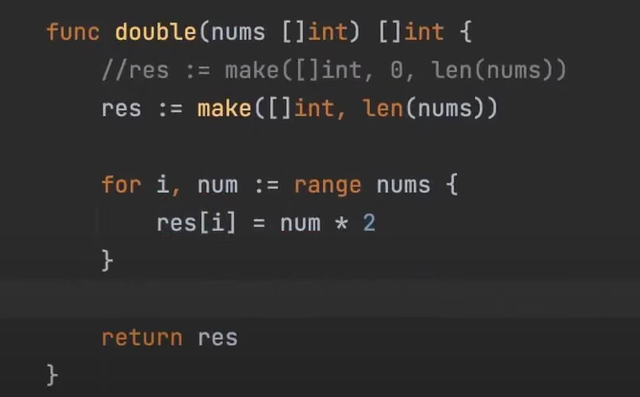
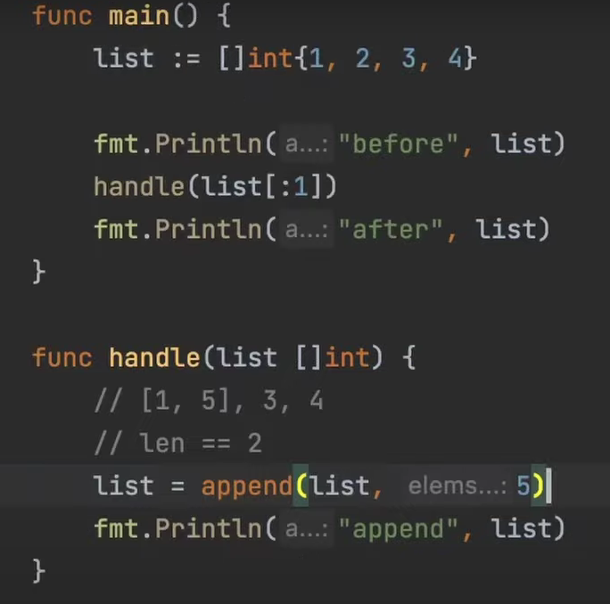
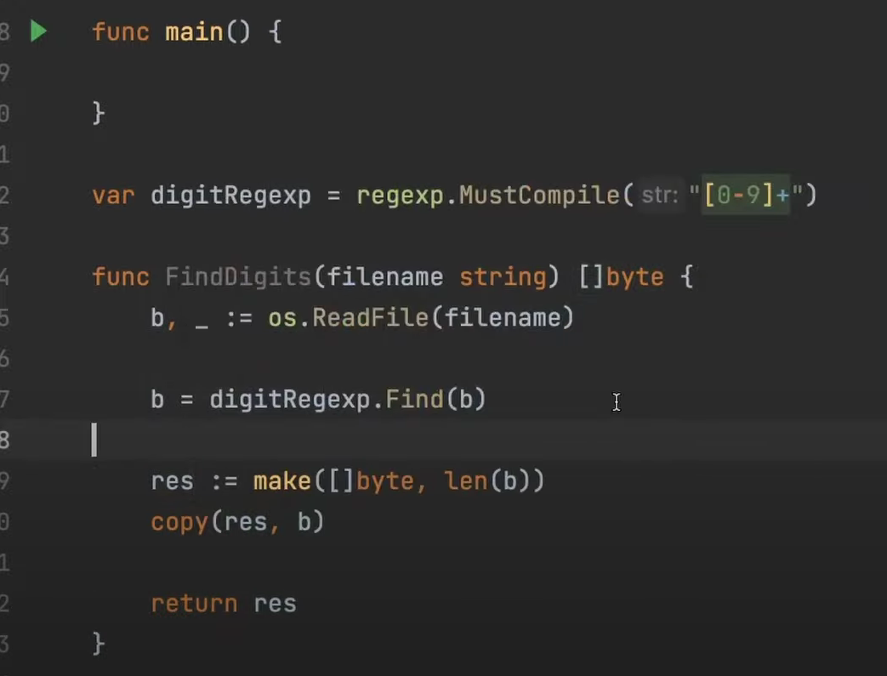

slice хранит в себе 3 элемента
```
pointer: *array ссылка на базовый массив 
на первый его элемент
length: int размер слайса текущий
capacity: int ёмкость массива
```

Функция append
при достижении length уровня capacity создается новый массив длинна которого в 2 раза больше предыдущего

нулевое значение слайса nil

```go
func main(){
	var list []int //(==nil)
	list2 = []list{} //!=nil
}
```

Бест практис напрямую проверять длинну слайса

```go
var list []int //(==nil)
len(list)
```

Аллокация памяти

```go
list := make([]int, 5,10)
```

оптимально либо делать вот так когда меняем слайс
list := make([]int, 5,10)
либо же задать сразу его размер
list := make([]int, 5)
Но в цикле не делать аппенд


если хотим изменить переданный слайс создаем его копию

после достижения 1024 размера увеличивается на четверть

Возможно переполнение

https://gist.github.com/GimmyHchs/33bd06e68d72a913a8587b09d41b50d0


```go
list := make([]int,4,4)
list2 := append(list,1)
list[0]=5
list2[0]=9
fmt.Println(list)
fmt.Println(list2)
```

```go
list := make([]int,4,5)
list2 := append(list,1)
list[0]=5
list2[0]=9
fmt.Println(list)
fmt.Println(list2)
```