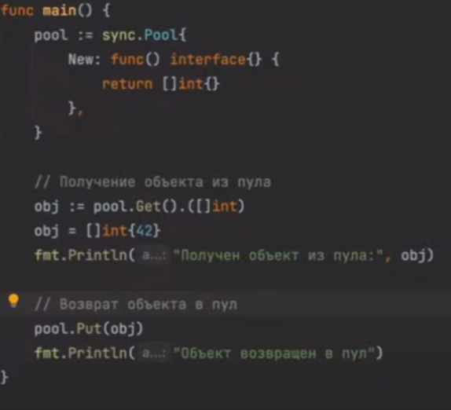

Горутины, каналы и селект — основные строительные блоки многозадачных программ на Go. Но не единственные. На этом уроке посмотрим на некоторые инструменты, которые предоставляет пакет `sync`.

### Группа ожидания (sync.WaitGroup)

С группы ожидания `[sync.WaitGroup](https://pkg.go.dev/sync#WaitGroup)` мы начали этот модуль. Давайте освежим:

```go
func main() {
var wg sync.WaitGroup

wg.Add(1)
go say(&wg, 1, "go is awesome")

wg.Add(1)
go say(&wg, 2, "cats are cute")

wg.Wait()
}

func say(wg *sync.WaitGroup, id int, phrase string) {
for _, word := range strings.Fields(phrase) {
time.Sleep(50 * time.Millisecond)
fmt.Printf("Worker #%d says: %s...\n", id, word)
}
wg.Done()
}
```

```no
Worker #1 says: go...
Worker #2 says: cats...
Worker #1 says: is...
Worker #2 says: are...
Worker #1 says: awesome...
Worker #2 says: cute...
```

Группа ожидания позволяет дождаться, пока отработают запущенные горутины. Внутри у нее счетчик, который мы увеличиваем методом `Add()` и уменьшаем методом `Done()`. Метод `Wait()` блокирует выполнение горутины, пока счетчик не достигнет 0.

Пара важных нюансов:

-   `Add()` вызывают не в запускаемой горутине, а в основной — той же, где затем будет `Wait()`. Иначе `Wait()` успел бы отработать до `Add()`. Он увидел бы, что счетчик пуст, после чего основная горутина завершилась.
-   Группу ожидания всегда передают по ссылке. Если передать ее по значению, запускаемая горутина получит копию с отдельным счетчиком. Мы же хотим использовать общий экземпляр группы, чтобы `Add()`, `Done()` и `Wait()` работали с одним и тем же счетчиком.

[песочница](https://go.dev/play/p/E9y-cIOAoAO)


### Одновременная модификация

До сих пор горутины у нас не лезли в дела друг друга. Чтобы обмениваться данными, они использовали каналы — это безопасно. Но что будет, если обращаться к «обычным» объектам из нескольких горутин? Проверим.

Напишем программу, которая считает частоту слов:

```go
func main() {
rand.Seed(0)

in := generate(100, 3)
counter := map[string]int{}

var wg sync.WaitGroup
wg.Add(2)

go count(&wg, in, counter)
go count(&wg, in, counter)

wg.Wait()

fmt.Println(counter)
}

// считает частоты слов
func count(wg *sync.WaitGroup, in <-chan string, counter map[string]int) {
defer wg.Done()
for word := range in {
counter[word]++
}
}

// генерит слова и отправляет их в канал
func generate(nWords, wordLen int) <-chan string {
// ...
}
```

`generate()` генерит слова и отправляет их в канал `in`. `main()` создает пустую карту `counter` и передает ее двум горутинам `count()`. `count()` читает из канала `in` и заполняет карту частотами слов. В результате в `counter` для каждого слова должна быть его частота.

Запустим:

```no
$ go run counter.go map[cec:1 ... nol:2 not:3 ... tut:1]
```

И еще раз, на всякий случай:

```no
$ go run counter.go fatal error: concurrent map writes
```

Ошибка.

Go не нравится одновременный доступ к карте из нескольких горутин. На первый взгляд, это странно. Вот единственная операция, которую горутина `count()` выполняет с картой:

```go
counter[word]++
```

Выглядит как атомарное действие. Почему бы не выполнять его из нескольких горутин?

Проблема в том, что действие только выглядит атомарным. Операция «увеличить значение в карте по ключу» состоит из цепочки более мелких действий. Если часть этих действий выполнит одна горутина, а часть другая — целостность карты будет нарушена. О чем Go нам и сообщает.

[песочница](https://go.dev/play/p/xYDGV0x_5kM)


### Мьютекс (sync.Mutex)

В пакете `sync` есть специальный инструмент, который защищает общие данные и участки кода (такие участки называются _критической секцией_) от одновременного доступа. Этот инструмент — _мьютекс_ `[sync.Mutex](https://pkg.go.dev/sync#Mutex)`:

```go
func main() {
in := generate(100, 3)
counter := map[string]int{}

var wg sync.WaitGroup
wg.Add(2)

var lock sync.Mutex    // (1)
go count(&wg, &lock, in, counter)
go count(&wg, &lock, in, counter)

wg.Wait()

fmt.Println(counter)
}

// считает частоты слов
func count(wg *sync.WaitGroup, lock *sync.Mutex, in <-chan string, counter map[string]int) {
defer wg.Done()
for word := range in {
lock.Lock()       // (2)
counter[word]++
lock.Unlock()     // (3)
```

Мьютекс гарантирует, что участок кода между `Lock()` и `Unlock()` выполняется только одной горутиной в каждый момент времени. Работает это так:

1.  В ➊ мы создаем мьютекс и передаем его обеим горутинам `count()`.
2.  В ➋ первая горутина «запирает» мьютекс, после чего выполняет `counter[word]++`.
3.  Если в этот момент вторая горутина дойдет до ➋, то она заблокируется, потому что мьютекс «заперт».
4.  В ➌ первая горутина «отпирает» мьютекс.
5.  Теперь вторая горутина разблокируется. Она, в свою очередь, запирает мьютекс и выполняет `counter[word]++`.

> В русскоязычной литературе принято переводить lock как «блокировать» и unlock как «разблокировать». Я буду переводить их как «запирать» и «отпирать», чтобы не было путаницы с блокированием и разблокированием горутин (в англоязычной литературе block и unblock).

Таким образом, `counter[word]++` не может выполняться несколькими горутинами одновременно. Теперь карта не пострадает:

```bash
$ go run -race counter.go map[cec:1 ... nol:2 not:3 ... tut:1]
```

Мьютекс используют в следующих ситуациях:

-   Если несколько горутин модифицируют одни и те же данные.
-   Если одна горутина модифицирует данные, а несколько читают.

Если все горутины только читают данные, мьютекс не нужен.

В отличие от некоторых других языков, мьютекс в Go не реентерабельный (non-reentrant). Если горутина вызовет `Lock()` на ей же запертом мьютексе — она заблокируется:

```go
var lock sync.Mutex lock.Lock() // ok lock.Lock() // fatal error: all goroutines are asleep - deadlock!
```

Это осложняет жизнь любителям использовать мьютексы в рекурсивных функциях (что в любом случае так себе идея).

Как и группа ожидания, мьютекс обладает внутренним состоянием, поэтому передавать его следует только по ссылке.

[песочница](https://go.dev/play/p/aHxU39eWr7u)


В пакете `sync` есть мьютекс, который разделяет писателей и читателей — `[sync.RWMutex](https://pkg.go.dev/sync#RWMutex)`. У него две пары методов:

-   `Lock()` / `Unlock()` запирает и отпирает мьютекс для чтения и записи.
-   `RLock()` / `RUnlock()` запирает и отпирает мьютекс для чтения.


### Карта с синхронизацией (sync.Map)

Считая частоты слов, мы защитили доступ к карте мьютексом:

```go
func main() { in := generate(100, 3) counter := map[string]int{} var wg sync.WaitGroup wg.Add(2) var lock sync.Mutex go count(&wg, &lock, in, counter) go count(&wg, &lock, in, counter) wg.Wait() fmt.Println(counter) }
```

Но вообще-то в пакете `sync` есть готовый тип `[sync.Map](https://pkg.go.dev/sync#Map)`, который можно безопасно использовать из нескольких горутин:

```go
func main() { rand.Seed(0) in := generate(100, 3) counter := new(sync.Map) var wg sync.WaitGroup wg.Add(2) go count(&wg, in, counter) go count(&wg, in, counter) wg.Wait() fmt.Println(asMap(counter)) } // считает частоты слов func count(wg *sync.WaitGroup, in <-chan string, counter *sync.Map) { defer wg.Done() for word := range in { freq, exists := counter.LoadOrStore(word, 1) if !exists { continue } counter.Store(word, freq.(int)+1) } } // преобразует sync.Map в обычную карту func asMap(counter *sync.Map) map[string]int { // ... }
```

Однако, я бы не торопился всюду его использовать. Во-первых, `sync.Map` нетипизированная (ключ и значение типа `any`), так что придется постоянно возиться с приведением типов. Во-вторых, она оптимизирована для двух специфических сценариев:

-   если значение по ключу записывается только однажды, а читается много раз;
-   если горутины работают с непересекающимися множествами ключей (каждая горутина работает только со своими ключами и не трогает чужие).

В остальных случаях `sync.Map` заметно медленнее, чем обычная карта в паре с мьютексом.

[песочница](https://go.dev/play/p/hVrRsm4WkuE)


### Атомарные операции (sync/atomic)

Вернемся к примеру с гонками при увеличении общего счетчика:

```go
func main() { var wg sync.WaitGroup total := 0 for i := 0; i < 5; i++ { wg.Add(1) go func() { defer wg.Done() for i := 0; i < 10000; i++ { total++ } }() } wg.Wait() fmt.Println("total", total) }
```

[песочница](https://go.dev/play/p/vPXn49kpgDR)

5 горутин, каждая увеличивает `total` 10000 раз — итого получается 50000. Проверим:

```no
$ go run total.go total 26775 $ go run total.go total 22978 $ go run total.go total 30357
```

Детектор гонок сигнализирует о проблеме:

```no
$ go run -race total.go ================== WARNING: DATA RACE ... ================== total 33274 Found 1 data race(s)
```

Выглядит странно. Ладно доступ к карте, но операция `total++` уж точно должна быть атомарной? На самом деле, нет. Она превращается в несколько отдельных инструкций процессора. Если часть инструкций выполнит одна горутина, а часть другая — это может нарушить целостность памяти. В результате часть инкрементов счетчика «пропадает».

Атомарной операция может быть только в одном случае — если она превращается в одну инструкцию процессора. Атомарные операции не требуют блокировок и не создают проблем при одновременном вызове. Даже операции записи.

В идеальном мире все операции были бы атомарными, и нам не пришлось бы возиться с мьютексами. На практике же атомарных операций совсем немного, и все они сосредоточены в пакете `[sync/atomic](https://pkg.go.dev/sync/atomic)`. Пакет предоставляет набор типов, которые поддерживают атомарные операции:

-   `Int32` — атомарное 4-байтное целое число;
-   `Int64` — атомарное 8-байтное целое число;
-   `Bool` — атомарное логическое значение;
-   и некоторые другие.

Каждый такой тип предоставляет методы `Load` (считывает значение переменной) и `Store` (записывает значение переменной). Численные типы дополнительно предоставляют `Add` (увеличивает значение переменной на указанную дельту):

```go
var n atomic.Int32 n.Store(42) fmt.Println(n.Load()) // 42 n.Add(42) fmt.Println(n.Load()) // 84
```

Все методы выполняются за одну инструкцию процессора, поэтому безопасны для одновременных вызовов.

Перепишем программу на использование атомиков:

```go
func main() { var wg sync.WaitGroup var total atomic.Int32 for i := 0; i < 5; i++ { wg.Add(1) go func() { defer wg.Done() for i := 0; i < 10000; i++ { total.Add(1) } }() } wg.Wait() fmt.Println("total", total.Load()) }
```

```no
$ go run -race total.go total 50000
```

Другое дело!

[песочница](https://go.dev/play/p/naC2KR8CwB7)

Pool 


`sync.Pool` - это механизм в языке программирования Go, предназначенный для повторного использования временных объектов с целью уменьшения накладных расходов на выделение и освобождение памяти.

Когда вам нужно многократно создавать и уничтожать однородные объекты (например, когда вы часто используете объекты определенного типа, такие как структуры), использование `sync.Pool` может значительно улучшить производительность вашего приложения.

`sync.Pool` сохраняет кэшированные объекты и переиспользует их при необходимости. Это особенно полезно в ситуациях, когда создание новых экземпляров объектов дорогостоящее операция.

Вы должны использовать `sync.Pool` только в случаях, когда заранее известно, что вы будете многократно использовать объекты одного типа, и создание или уничтожение этих объектов будет происходить часто. Использование `sync.Pool` для других целей может ухудшить производительность из-за накладных расходов на управление пулом объектов.

В общем, `sync.Pool` полезен, когда нужно уменьшить накладные расходы на аллокацию и освобождение памяти при работе с временными объектами.
