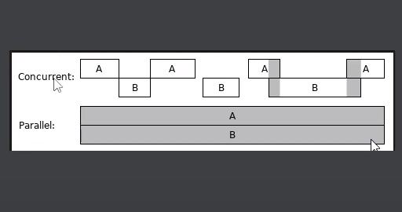
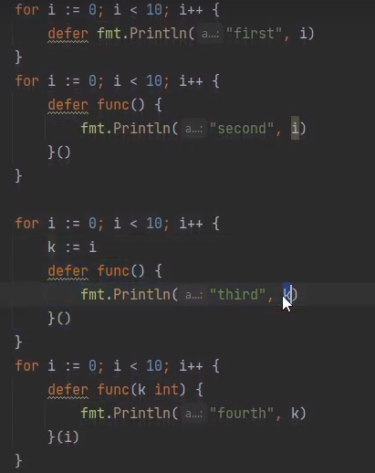
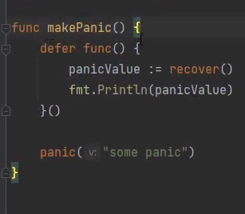

горутина легковесный поток 2Кб Треб 8мб 

Горутина управляет планировщик ГО

А потоками ОС
 
```go
fmt.Println(runtime.NumCPU())
```

```go
runtime.GOMAXPROCS(1)
```

```go
runtime.Gosched() 
```

defer выполняется в обратном порядке 






У горутины динамически расширяемыйф стек
и на её создание требуется 2 процессорные операции
