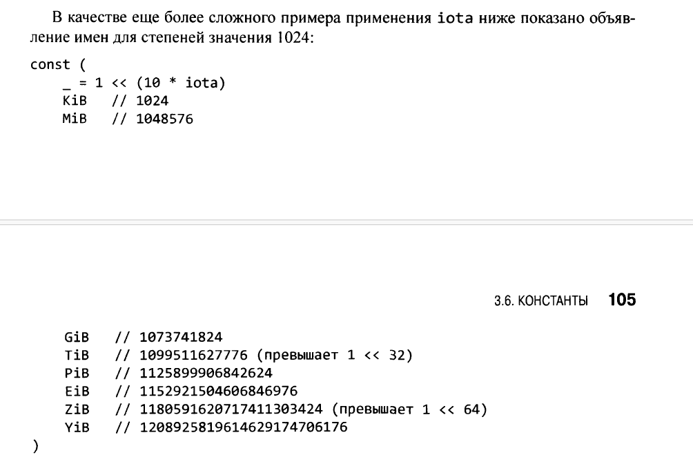

Константы представляют собой выражения, значения которых известны компилятору и вычисление которых гарантированно происходит во время компиляции, а не во время выполнения. Базовым типом каждой константы является фундаментальный тип: логическое значение, строка или число.
Объявление const определяет именованные значения, которые синтаксически выглядят как переменные, значения которых являются константами, что предотвращает их случайное (или ошибочное) изменение во время выполнения программы. Например, для представления такой математической константы, как число я, константа предпочтительнее переменной, поскольку значение этого числа не изменяется:
const pi = 3.14159 // Лучшим приближением является math.Pi
Как и в случае переменных, в одном объявлении может находиться последовательность констант; такое объявление подходит для групп связанных значений:
const (
е = 2.7182818284590452353602874713526624977572470936999595749669 pi = 3.1415926535897932384626433832795028841971693993751058209749
)
const IPv4Len = 4

Генератор констант iota

Объявление const может использовать генератор констант iota, который применяется для создания последовательности связанных значений без их явного указания. В объявлении const значение iota начинается с нуля и увеличивается на единицу для каждого элемента в последовательности.
Вот пример из пакета time, который определяет именованные константы типа Weekday для дней недели, начиная с нуля для Sunday. Типы такого рода часто именуются перечислениями.
```
type Weekday int const (
Sunday Weekday = iota
Monday
Tuesday
Wednesday
Thursday
Friday
Saturday
)
```

Это объявление определяет Sunday как 0, Monday — как 1 и т.д.
Можно использовать iota и в более сложных выражениях, как в приведенном далее примере из пакета net, где каждому из младших пяти битов целого беззнакового числа присваивается уникальное имя:
```
type Flags uint const (
FlagUp Flags = 1 << iota // is up
FlagBroadcast
FlagLoopback
FlagPointToPoint
FlagMulticast
)
```

