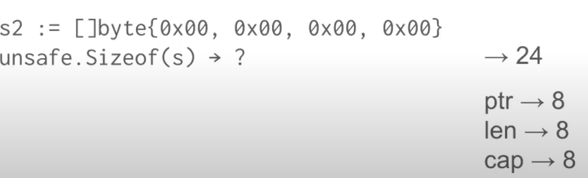
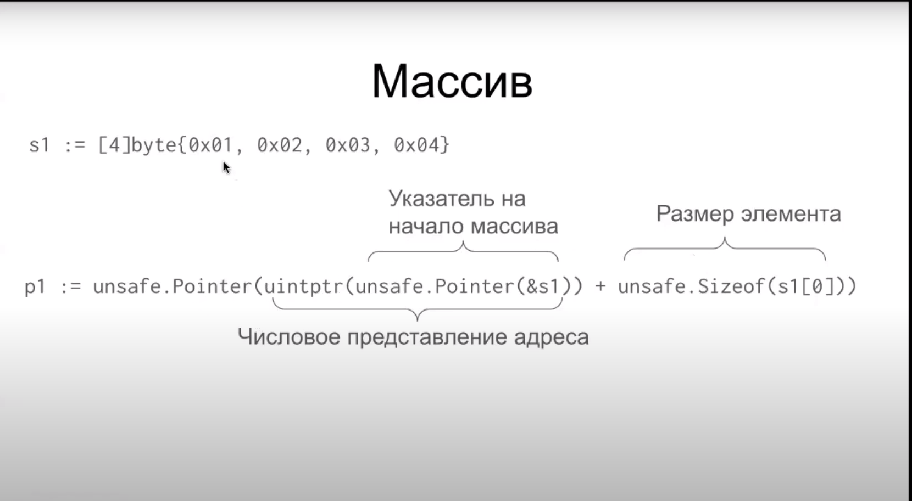
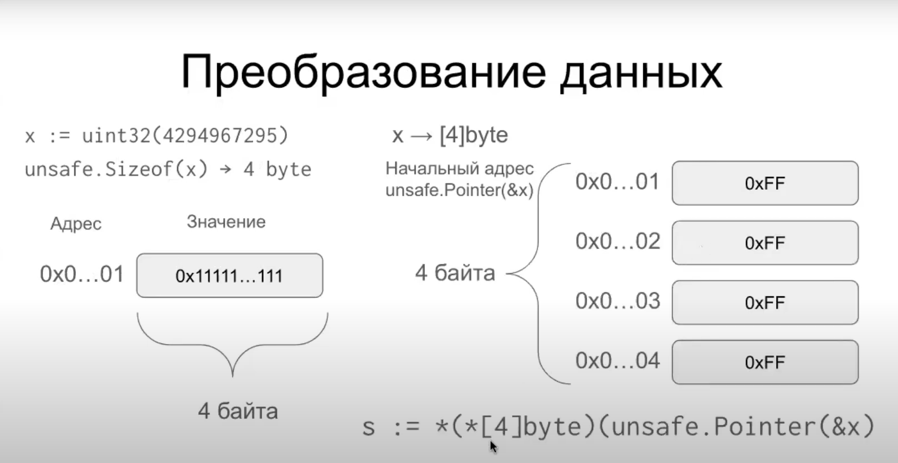
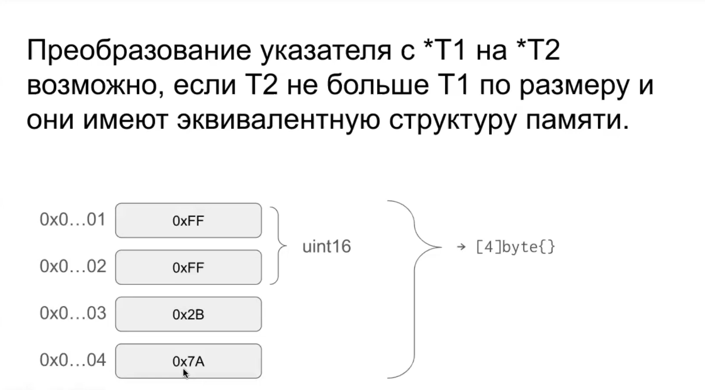
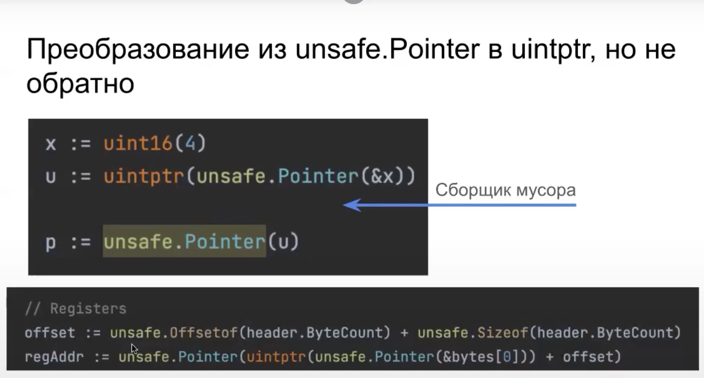

unsafe.Pointer

Указатель на произвольный тип

```go
x := uint32(4)
p := unsafe.Pointer(&x)
```
Может быть получен из обычного указателя и  преобразован в указатель любого типа

```go
x := uint32(4)
rp := &x
p := unsafe.Pointer(pr)
newPtr := (*int32)(p)
```

unsafe.Sizeof
Размер в байтах

Размер зависит от машинного слова


unsafe.Alignof

Функция `unsafe.Alignof` в языке программирования Go возвращает "безопасное" значение выравнивания для типа данных.

В языке Go значения имеют определенные требования к выравниванию в памяти. Например, тип данных `int` может требовать выравнивание по границе в 4 байта (32 бита), тогда как тип `int64` может требовать выравнивание по границе в 8 байт (64 бита).

Функция `unsafe.Alignof` позволяет получить это значение выравнивания для конкретного типа данных. Она работает с различными типами, включая пользовательские типы, и возвращает размер выравнивания в байтах.

Важно отметить, что использование `unsafe.Alignof` является частью пакета `unsafe` в Go, который предназначен для низкоуровневых и потенциально опасных операций. Использование этой функции требует осторожности, так как она обходит некоторые механизмы безопасности, предоставляемые языком. 🛡️


unsafe.Offset
Функция `unsafe.Offsetof` в языке программирования Go возвращает смещение указанного поля в байтах от начала структуры. Она работает только с полями структур и не поддерживает другие типы данных.

Эта функция используется в пакете `unsafe` для выполнения низкоуровневых операций, таких как взаимодействие с памятью или указателями. Однако, ее использование требует осторожности, так как она обходит механизмы безопасности, предоставляемые языком программирования Go.

Если у вас есть конкретные вопросы о `unsafe.Offsetof`, буду рад помочь! 🛡️









go vet


