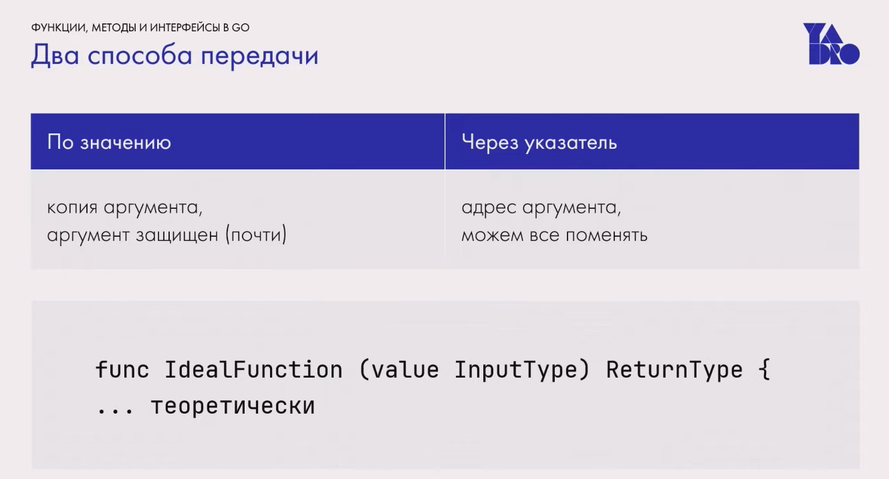
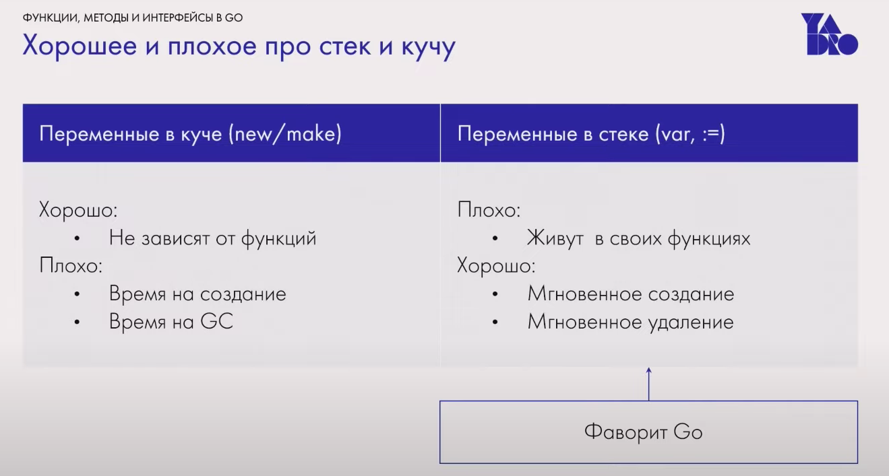
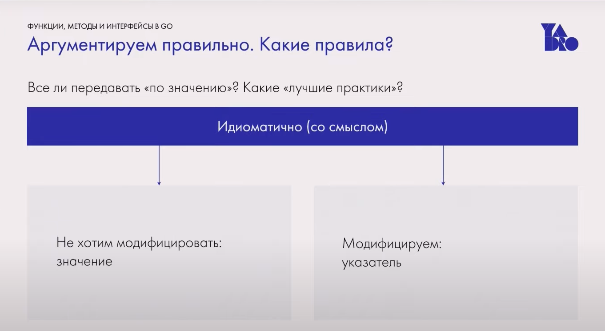
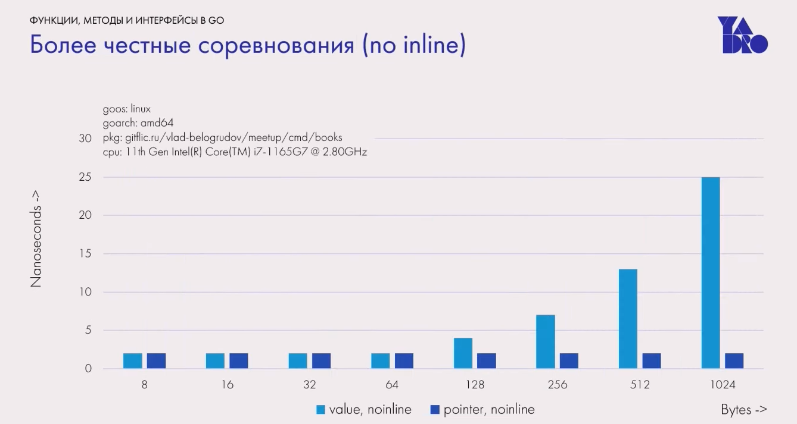
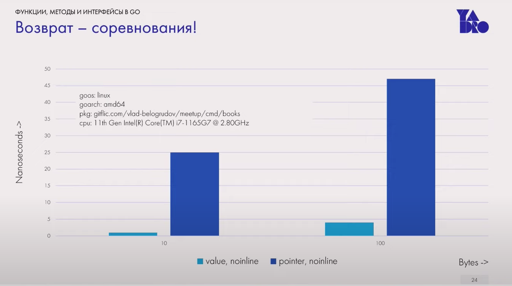
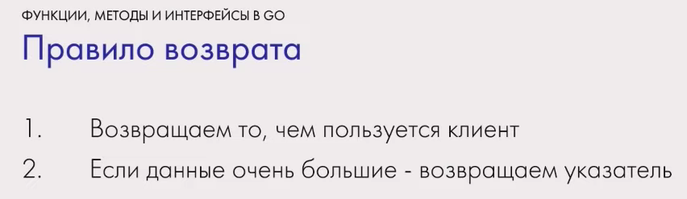
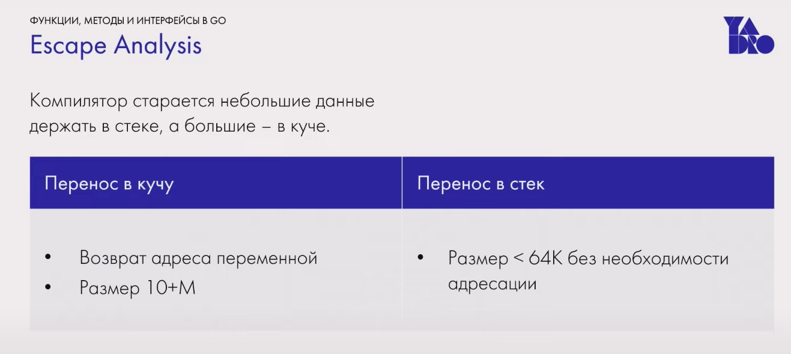

Плюсы передачи копии: 
1. проще анализировать потоки данных
2. Без побочных эффектов
3. проще параллелить

В го нет неизменяемых объектов. Конст это псевдоним литерала

В heap лежат переменные выделяемые через make new. Чтобы разместить там струкутуру нужно найти участок памяти, что не всегда просто

Stack лежат автоматичкие переменные через var := . Выделение памяти в стеке мгновернное из-за сдвига стекового указателя

Большие данные это сколько?

До 100 байт нет разницы

Возврат

Значение сразу в стеке
Поэтому его бытсрее создать и возвращать 
Вплоть до 10 мегабайт

 